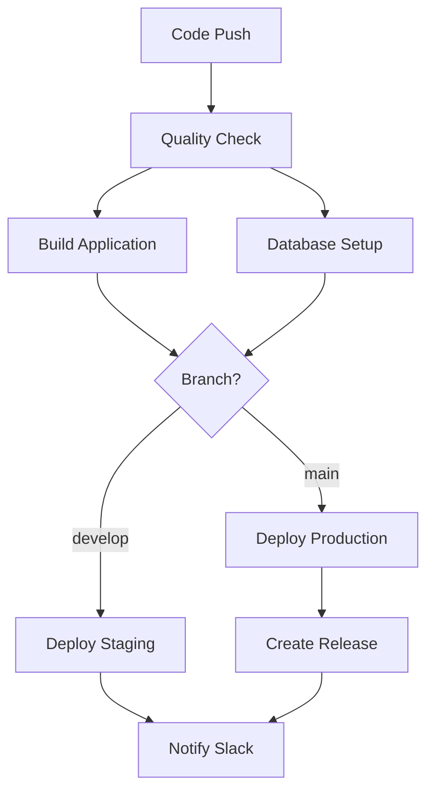

# TrackAS Automation Guide

This guide explains the comprehensive automation system implemented for TrackAS, covering all automated workflows, processes, and management procedures.

## 🎯 Overview

TrackAS automation system handles the complete logistics operation lifecycle:

1. **Registration & Verification Automation**
2. **VCODE Generation & Assignment**
3. **Shipment Processing & Matching**
4. **Real-time Notifications**
5. **Payment Processing**
6. **Performance Analytics**
7. **System Monitoring**

## 🚀 Automation Workflows

### 1. CI/CD Pipeline (`ci-cd.yml`)

**Triggers:**
- Push to `main` or `develop` branches
- Pull requests to `main` or `develop`

**Workflow Steps:**


**Jobs:**
- **quality-check**: Linting, type checking, testing, security audit
- **build**: Application build with artifact upload
- **database-setup**: Automated migration deployment
- **deploy-staging**: Vercel staging deployment (develop branch)
- **deploy-production**: Vercel production deployment (main branch)
- **notify**: Slack notifications for deployment status

### 2. Database Automation (`database-automation.yml`)

**Triggers:**
- **Scheduled**: Every hour (verifications), every 5 minutes (shipments)
- **Manual**: Workflow dispatch with operation selection

**Operations:**

#### Process Verifications
- **Frequency**: Hourly
- **Function**: Auto-approve registrations after 24-48 hours
- **Scope**: Companies, vehicles, operators
- **Verification Steps**:
  - TIN/Business registration validation
  - Vehicle documentation check
  - Driver license verification
  - Insurance validation

#### Generate VCODEs
- **Frequency**: Hourly
- **Function**: Create unique vehicle codes for subscription model
- **Format**: `[Company3Letters][VehicleType1Letter][Timestamp6Digits]`
- **Example**: `ABCT123456` (ABC Company, Truck, timestamp)

#### Assign Shipments
- **Frequency**: Every 5 minutes
- **Function**: Automatic shipment-to-operator matching

**Subscription Model Logic:**
```javascript
function assignSubscriptionShipment(shipment) {
  // Find company's registered vehicles with VCODEs
  // Match by capacity and proximity
  // Auto-assign to best vehicle
  // 15-minute acceptance window
}
```

**Pay-Per-Shipment Logic:**
```javascript
function assignPayPerShipment(shipment) {
  // Find all qualified operators
  // Sort by rating and proximity
  // Send requests to top 3 operators
  // 15-minute acceptance window
  // Auto-reassign if all reject
}
```

#### Update Ratings
- **Frequency**: On-demand
- **Function**: Calculate operator performance metrics
- **Formula**: `(Customer Rating + Logistics Rating) / 2`

#### Process Payments
- **Frequency**: On-demand
- **Function**: Calculate and process operator payments
- **Pricing Formula**:
  ```
  Payment = Distance × BaseRate × WeightMultiplier × UrgencyMultiplier
  BaseRate = $2.50 per mile
  WeightMultiplier = Weight × 0.1
  UrgencyMultiplier = 1.5 (urgent) or 1.0 (normal)
  ```

### 3. Notification Automation (`notification-automation.yml`)

**Triggers:**
- **Scheduled**: Every 2 minutes for real-time updates
- **Manual**: Workflow dispatch with notification type selection

**Notification Types:**

#### Shipment Confirmations
- **Trigger**: New shipment assignments
- **Recipients**: Logistics company, customer
- **Channels**: Email, WhatsApp
- **Content**: Operator details, tracking link, estimated times

#### Pickup Notifications
- **Trigger**: Shipment pickup confirmation
- **Recipients**: Logistics company, customer
- **Content**: Pickup time, location, delivery estimate

#### Delivery Updates
- **Trigger**: Successful delivery
- **Recipients**: Logistics company, customer
- **Content**: Delivery confirmation, proof of delivery, feedback link

#### Payment Notifications
- **Trigger**: Payment processing completion
- **Recipients**: Operators
- **Content**: Payment amount, shipment details, transaction ID

#### Expired Request Cleanup
- **Trigger**: 15-minute timeout on shipment requests
- **Function**: Mark expired, reassign shipments if needed

## 🛠 Development Automation Scripts

### Setup Script (`scripts/setup.sh`)
**Purpose**: Complete development environment setup

**Functions:**
- Node.js version validation
- Dependency installation
- Supabase CLI setup
- Environment configuration
- Git hooks installation
- Development tools configuration

**Usage:**
```bash
./scripts/setup.sh
```

### Development Script (`scripts/dev.sh`)
**Purpose**: Start full development environment

**Services Started:**
- Supabase local instance
- Vite development server
- Hot reload enabled

**Usage:**
```bash
./scripts/dev.sh
```

### Build Script (`scripts/build.sh`)
**Purpose**: Production build with quality checks

**Process:**
1. ESLint validation
2. TypeScript type checking
3. Prettier format verification
4. Test execution
5. Production build

**Usage:**
```bash
./scripts/build.sh
```

### Deploy Script (`scripts/deploy.sh`)
**Purpose**: Environment-specific deployment

**Environments:**
- `staging`: For testing and validation
- `production`: For live deployment

**Process:**
1. Run build script
2. Database migrations (production only)
3. Vercel deployment
4. Verification checks

**Usage:**
```bash
./scripts/deploy.sh staging
./scripts/deploy.sh production
```

### Monitor Script (`scripts/monitor.sh`)
**Purpose**: System health monitoring

**Checks:**
- Application health endpoints
- Database connectivity
- Pending migrations
- Service status

**Usage:**
```bash
./scripts/monitor.sh
```

### Backup Script (`scripts/backup.sh`)
**Purpose**: Database backup and rotation

**Features:**
- Schema and data backup
- Compression (gzip)
- Automatic cleanup (keep last 10)
- Timestamped files

**Usage:**
```bash
./scripts/backup.sh
```

## 🐳 Docker Automation

### Development Environment
**Services:**
- **TrackAS App**: React development server
- **PostgreSQL**: Database with auto-seeding
- **Redis**: Caching and sessions
- **Nginx**: Load balancing and SSL
- **Prometheus**: Metrics collection
- **Grafana**: Visualization dashboards

**Usage:**
```bash
# Start all services
docker-compose up -d

# Monitor logs
docker-compose logs -f app

# Scale services
docker-compose up -d --scale app=3
```

### Production Deployment
**Multi-stage Build:**
1. **Builder Stage**: Install deps, build app
2. **Production Stage**: Nginx with optimized assets

**Features:**
- Optimized image size
- Health checks
- Security hardening
- Auto-restart policies

## 📊 Monitoring & Alerting

### Prometheus Metrics
**Application Metrics:**
- Request/response times
- Error rates
- Active users
- Database connections

**Business Metrics:**
- Shipments per hour
- Operator utilization
- Payment processing times
- Customer satisfaction scores

### Grafana Dashboards
**System Dashboard:**
- CPU/Memory usage
- Database performance
- API response times
- Error tracking

**Business Dashboard:**
- Shipment status distribution
- Operator performance rankings
- Revenue analytics
- Geographic heat maps

### Alerting Rules
**Critical Alerts:**
- Application downtime
- Database connection failures
- High error rates (>5%)
- Payment processing failures

**Warning Alerts:**
- Slow response times (>2s)
- High queue lengths
- Low operator availability
- Unusual traffic patterns

## 🔧 Configuration Management

### Environment Variables
**Required Secrets:**
```env
# Supabase
SUPABASE_PROJECT_ID=
SUPABASE_ACCESS_TOKEN=
SUPABASE_SERVICE_KEY=
VITE_SUPABASE_URL=
VITE_SUPABASE_ANON_KEY=

# Deployment
VERCEL_TOKEN=
VERCEL_ORG_ID=
VERCEL_PROJECT_ID_STAGING=
VERCEL_PROJECT_ID_PRODUCTION=

# Notifications
SLACK_WEBHOOK_URL=
TWILIO_ACCOUNT_SID=
TWILIO_AUTH_TOKEN=
SENDGRID_API_KEY=
```

### Feature Flags
**Available Flags:**
- `VITE_ENABLE_ANALYTICS`: Analytics tracking
- `VITE_ENABLE_NOTIFICATIONS`: Real-time notifications
- `VITE_ENABLE_MONITORING`: Performance monitoring
- `VITE_ENABLE_DEBUG`: Debug logging

## 🚨 Troubleshooting

### Common Issues

#### Failed Verifications
**Symptoms**: Companies/vehicles stuck in pending status
**Solution**: 
```bash
# Manually trigger verification processing
gh workflow run database-automation.yml -f operation=process_verifications
```

#### Missed Notifications
**Symptoms**: Users not receiving updates
**Solution**:
```bash
# Check notification queue status
./scripts/monitor.sh

# Trigger notification processing
gh workflow run notification-automation.yml -f notification_type=all
```

#### Assignment Failures
**Symptoms**: Shipments not getting assigned
**Solution**:
```bash
# Check operator availability
./scripts/monitor.sh

# Trigger assignment processing
gh workflow run database-automation.yml -f operation=assign_shipments
```

### Log Analysis
**Application Logs:**
```bash
# View real-time logs
docker-compose logs -f app

# Search for errors
docker-compose logs app | grep ERROR
```

**Database Logs:**
```bash
# Monitor slow queries
docker-compose logs postgres | grep "slow"
```

### Performance Optimization

#### Database Optimization
- Monitor query performance
- Index optimization
- Connection pooling
- Read replicas for analytics

#### Application Optimization
- Bundle size monitoring
- Lazy loading implementation
- Caching strategies
- CDN utilization

## 📈 Metrics & KPIs

### System Metrics
- **Uptime**: Target 99.9%
- **Response Time**: Target <500ms
- **Error Rate**: Target <1%
- **Throughput**: Shipments per hour

### Business Metrics
- **Registration Approval Time**: Target <24 hours
- **Shipment Assignment Time**: Target <5 minutes
- **Delivery Success Rate**: Target >95%
- **Customer Satisfaction**: Target >4.5/5

### Automation Efficiency
- **Automated Verifications**: Target >90%
- **Successful Auto-assignments**: Target >85%
- **Notification Delivery Rate**: Target >99%
- **Payment Processing Accuracy**: Target 100%

## 🔮 Future Enhancements

### Planned Automation Improvements
1. **ML-based Operator Matching**: Use machine learning for better assignments
2. **Predictive Analytics**: Forecast demand and optimize resources
3. **Smart Notifications**: Context-aware notification timing
4. **Automated Route Optimization**: AI-powered route planning
5. **Dynamic Pricing**: Real-time pricing based on demand/supply

### Integration Roadmap
1. **Government API Integration**: Real-time verification
2. **Banking API Integration**: Instant payment processing
3. **Weather API Integration**: Route optimization based on conditions
4. **Traffic API Integration**: Real-time ETA updates

---

**Automation Owner**: Vipul Sharma  
**Last Updated**: January 2025  
**Version**: 1.0